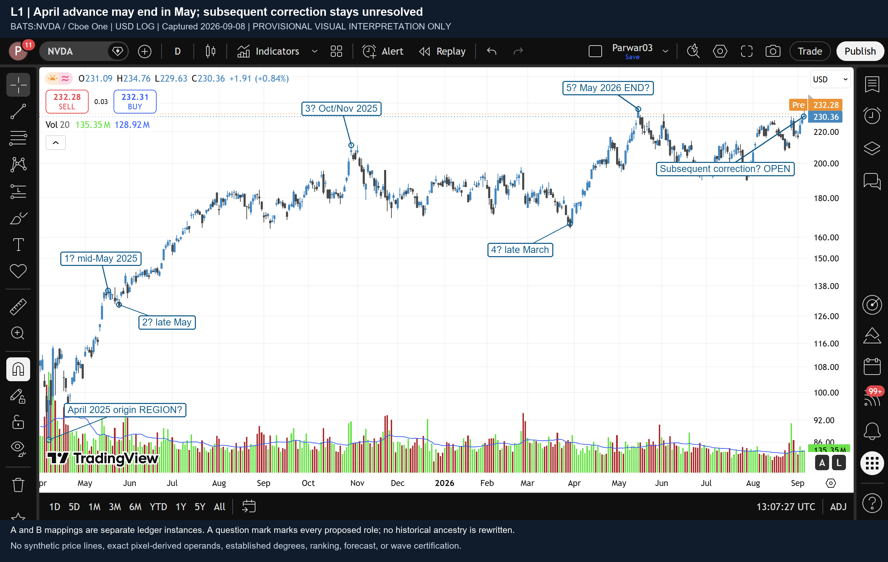
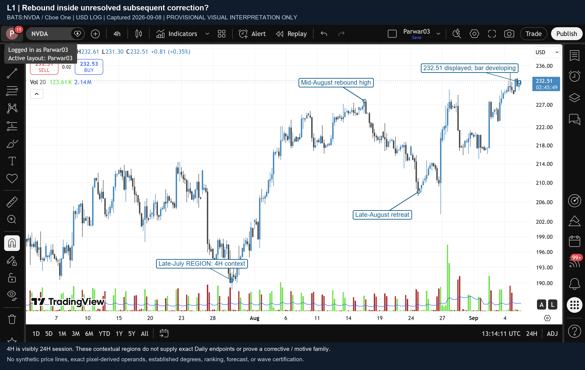
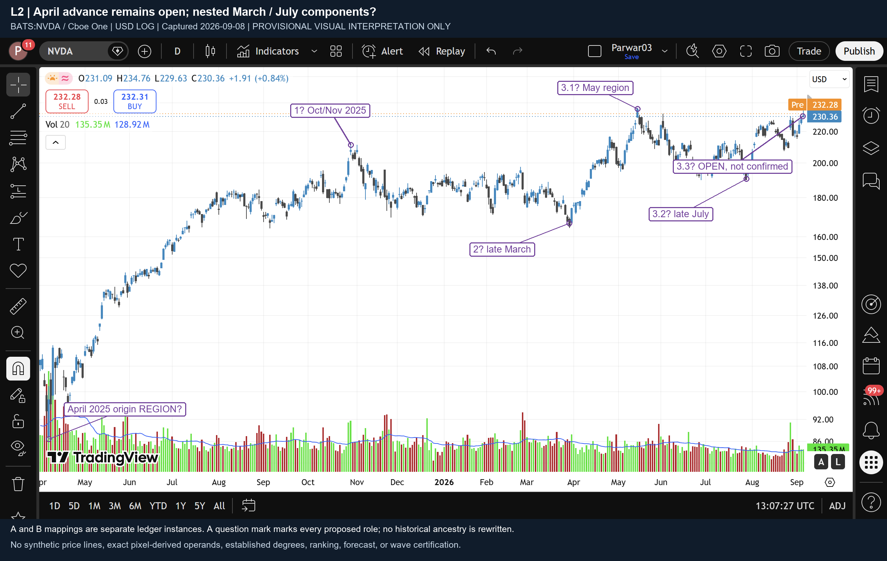
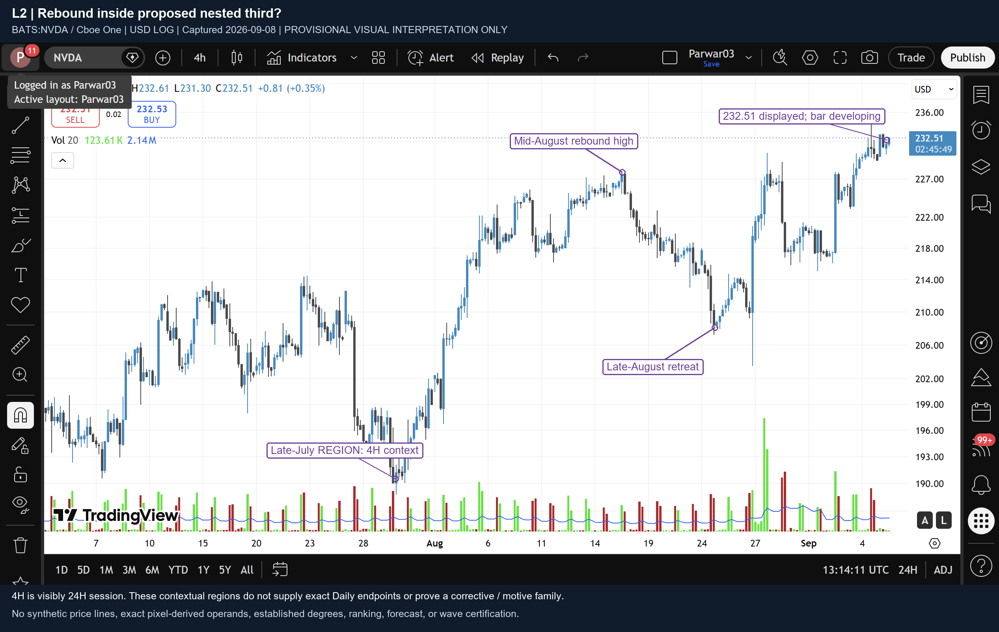

# NVDA: أين تقع الحركة الأخيرة، مشروطًا؟

**النتيجة: قراءتان محليتان ما زالتا ممكنتين، دون ترتيب أو عدّ مؤكد.** في L1 قد تكون حركة أبريل 2025 انتهت عند منطقة مايو 2026، والارتداد الأخير داخل تصحيح لاحق غير محسوم. في L2 تبقى حركة أبريل مفتوحة، وقد يقع الارتداد منذ أواخر يوليو داخل ثالثة متفرعة. الفارق بينهما هو **تجميع الداخليات وأبوّتها**، لا قوة السعر أو عدد الشموع وحده.

هذه قراءة بصرية مشروطة، منفصلة عن `CURRENT_WAVE_POSITION_UNRESOLVED`. لم تُشغَّل مقيمات المنهجية، ولم تصدر شهادة عائلة أو نتيجة P004/P005 من الصور.

## أولًا: ما آخر دليل زمني فعلًا؟

اللقطات جديدة بتاريخ **8 سبتمبر 2026، بين 13:07 و13:15 UTC**، من **BATS:NVDA / Cboe One**؛ NASDAQ هو معرّف الإدراج فقط. لا بيانات Yahoo هنا.

المؤشر على آخر شمعة يومية يقرأ **الجمعة 4 سبتمبر 2026**، والقيم المعروضة: O 231.09، H 234.76، L 229.63، C 230.36. هذه قراءات شاشة موثقة، وليست تصدير OHLCV أو أطرافًا أرثوذكسية معتمدة. مستوى المؤشر 230.43 ليس إغلاق الشمعة. [الدليل الأصلي](originals/last_bar_reading.png)

أما لقطة 4 ساعات عند 13:14:14 UTC فتعرض **232.51** وعدّاد **02:45:49**: شمعة جارية، لا موجة مكتملة. وقت بدء هذه الشمعة لم يُتحقق منه مستقلًا. عرض 4 ساعات يحمل **24H**، بينما إعداد جلسة اليومي الدقيق غير متحقق، ويعرض سعرًا منفصلًا لما قبل الافتتاح. لذلك لا نخلط قمم الجلسات أو نمد آخر طرف يومي إلى السعر الجاري. قراءة ما قبل الافتتاح تغيرت بين اللقطات؛ ليست اللقطات سجلًا سوقيًا آنيًا موحدًا.

## L1 — نهاية محتملة في مايو، ثم تصحيح مفتوح

**موضع آخر دليل، مشروطًا:** ارتداد داخل مكوّن تصحيحي لاحق بدأ في **منطقة منتصف مايو 2026**. الارتداد نفسه يبدأ في **منطقة أواخر يوليو**؛ كلا الطرفين مناطق بصرية تقريبية، لا تاريخا انعكاس دقيقان. لا أسمي هذا الارتداد B أو التصحيح Flat/Triangle.

التقسيم اليومي المقترح للمكوّن أبريل→مايو هو:

1. أبريل 2025 → قمة منتصف مايو 2025.
2. تراجع أواخر مايو 2025.
3. صعود إلى قمة أواخر أكتوبر/بداية نوفمبر 2025، يحوي حركة الصيف وتراجع سبتمبر غير المحسوم داخليًا.
4. تراجع/نطاق ممتد إلى قاع أواخر مارس 2026.
5. صعود إلى منطقة قمة مايو 2026 — **نهاية مفترضة فقط**.

عرض 4 ساعات كشف أن هبوط ما بعد مايو متقطع: تراجعات وارتدادات في يونيو، مناطق منخفضة أواخر يونيو/أوائل يوليو، ارتداد يوليو، ثم قاع أواخر يوليو. وبعده صعود إلى منتصف أغسطس، تراجع أواخر أغسطس وارتداد لاحق. هذا يدعم دراسة التصحيح بوصفه بنية مترابطة، **لكنه لا يثبت أنه ثلاثة ولا أنه انتهى في يوليو**.

**الربط الصحيح:** تحت A، هذه بديلة صريحة تُغلق المكوّن المقابل لـ `A.5.3` افتراضيًا في مايو؛ التصحيح اللاحق أخ له تحت سياق `A.5`. وتحت B، تغلق بديلة المكوّن المقابل لـ `B.3.3.3.3` وتضع اللاحق أخًا له تحت `B.3.3.3`. المعرّفات الجديدة `A.L1` و`B.L1` لا تستبدل التقرير القديم، ولا يوضع سعر سبتمبر داخل أب انتهى في مايو.

**غير المحسوم:** إثبات الداخليات الدافعة، نقطة انتهاء الخامسة، وتركيب التصحيح اللاحق. احتمال أن التصحيح انتهى في يوليو وأن الارتداد مكوّن تالٍ ليس منفيًا؛ لا توجد أدلة كافية لإضافة عدّ ثالث كامل.

**الدليل الفاصل المطلوب:** داخليات أوضح وبجلسة متسقة للساق مارس→مايو وللهبوط مايو→يوليو والارتداد بعدها، تحدد هل يصح تجميع الأولى نهايةً للمكوّن كله وهل اللاحق تصحيح مستمر أم مكوّن جديد. هذا طلب دليل يميز القراءات، وليس حد إبطال سعريًا أو توقعًا.

## L2 — حركة أبريل مستمرة مع تفرع داخلي

**موضع آخر دليل، مشروطًا:** ثالثة داخل ثالثة مقترحة؛ المكوّن الأقرب يبدأ في **منطقة أواخر يوليو 2026**، داخل مكوّن بدأ **أواخر مارس 2026**، داخل حركة أبريل 2025 المفتوحة. الدقة مناطق بصرية، ولا تمنح أسماء المراحل درجة Elliott ثابتة.

هنا تُجمع أبريل→أكتوبر 2025 أولى محتملة، وأكتوبر→مارس ثانية غير مصنفة، ومارس→آخر دليل ثالثة مفتوحة. داخل الأولى يمكن اقتراح خمس مناطق: منتصف مايو، أواخر مايو، هضبة يوليو/أغسطس، تراجع سبتمبر، ثم أكتوبر. النافذة الجديدة أزالت فجوة يونيو–أغسطس من **الفحص اليومي**؛ لم تثبت العائلات الداخلية.

داخل الثالثة: مارس→مايو أولى محتملة، مايو→أواخر يوليو ثانية محتملة، ثم ثالثة مفتوحة منذ يوليو. الدليل الأقرب هو الارتداد المتجزئ في أغسطس وسبتمبر؛ لا نفرض عليه خمس تسميات أخرى، ولا نستنتج الامتداد من حدة الصعود.

**الربط:** `A.L2.advance` استمرار مشروط لـ `A.5.3`، و`B.L2.advance` استمرار مشروط لـ `B.3.3.3.3`. لكل منهما أطفال مستقلون بالهوية في الجدول. تشابه الأسعار ليس تأكيدين مستقلين.

**غير المحسوم:** هل أبريل→أكتوبر عائلة دافعة فعلًا، وهل تراجع مايو→يوليو انتهى؛ الصور لا تثبت ذلك. لا نستنتج أن إخفاق L1 يصحح L2، أو أن آخر ارتفاع هو ثالثة لمجرد أنه آخر جزء ظاهر.

**الدليل الفاصل المطلوب:** تحديد العائلات الداخلية ضمن أب واحد وبأطراف متسقة، خصوصًا التصحيح أكتوبر→مارس والساق مارس→مايو ثم تراجعها. إن لم تدعم الداخليات هذه التجميعات تبقى L2 غير محسومة، دون تصنيع بديل صحيح تلقائيًا.

## المنهجية وحدود هذه القراءة

المراجع الدقيقة في [سجل المصادر](source_references.json):

- **تعريف:** الكتاب ص31، بنية الموجة الدافعة الخماسية وداخلياتها (S5). لذلك عُرضت خانات مقترحة، لا شهادة ناتجة عن خمس انعطافات.
- **إرشاد/مثال:** الكتاب ص32–33، الشكلان 1-5 و1-8؛ والمجلد8 عند 08:10.130–09:23.600، التفرع وقراءات 1–2 المتداخلة (S3/S6). يجيزان دراسة التنظيم، ولا يختاران قراءة NVDA ولا يعدانها مؤكدة.
- **إرشاد:** المجلد8، 04:47.070–06:37.050، السياق الكبير ثم الصغير (S2). لم نعد بناء التاريخ السابق.
- **ملاحظة:** المجلد10، 02:18.480–03:35.760، تجميع الشموع قد يخفي الداخليات (S4). لا نخلق موجات عند غياب الدقة.
- **قاعدة/سياسة محفوظة:** المجلد1، 29:45.679–31:41.909، والسياسة المعتمدة (S1/S7). مناطق الثانية المقترحة لا تُظهر بصريًا كسرًا واضحًا لأصل الأولى المقترح، لكن هذا **ليس RULE_SATISFIED**. لا حساب P005 من التقديرات؛ كفايته الجزئية لا تنقذ رفض P004. P006 يظل مجمدًا/متعارضًا، دون حكم تداخل هنا.

بقيت Flat/Triangle مجمدتين، و`SOURCE_DERIVED_BASE_CASE_NOT_FOUND` قائمًا. الحجم ظاهر لكنه ليس تأكيدًا، وRSI غير مستخدم. لا أهداف أو حدود إبطال رقمية أو ترجيح أو توصيات تداول.

## ما تحسن وما بقي؟

تحسن الفحص من وصف عام «مايو/يوليو/ارتداد» إلى قراءتين بأبوّة متسقة، وفحص فجوة صيف2025، وتصحيح أكتوبر→مارس، وداخليات مايو→سبتمبر على 4 ساعات. تأكد تاريخ آخر شمعة يومية بدل تركه «أوائل سبتمبر».

بقيت الداخليات الأدق من4ساعات وغير المفحوصة قبل مايو2026، وتسوية اختلاف الجلسات، والأطراف التاريخية الدقيقة، وإثبات الاكتمال والعائلات. استُخدمت النظرة العامة +6لقطات مستهدفة، دون تجاوز الحد أو إعادة تشغيل المحرك. لا نعامل نفاد ميزانية النظر دليلًا على استحالة موجة.

الجدول [node_table.md](node_table.md) و[JSON](hierarchy.json) يربطان كل عقدة بأب واحد وأدلة بداية ونهاية؛ [سجل الالتقاط](capture_provenance.json) يميز مجال العرض من بيانات الشموع ومن مناطق الانعكاس. التقرير بصيغة Markdown والصور لتجنب إضافة إطار عرض أو مقاييس زخرفية، وفق نطاق الطلب.
